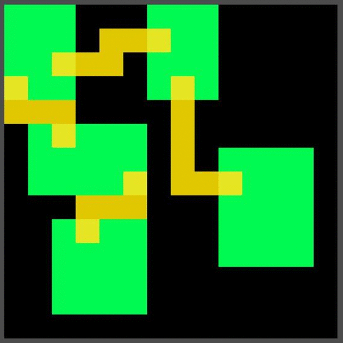
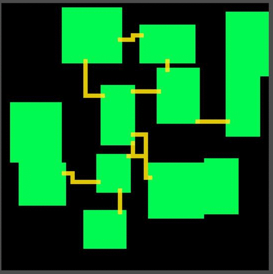

# Dungeon Generation Algorithm

--

Randomly generates rooms by trial and checking (bad and inefficient solution, to be replaced later)

Generates the triangle mesh result from Delaunay's Triangulation on the rooms' centers

Transforms the triangle mesh into a weighted graph

Applies Prim's Algorithm to get a Minimum Spanning Tree

Randomly adds other edges to the MST

Creates simple hallways to connect the random points in the rooms following the edges selected

--

## Examples

### Hallway calculation

### Hallway examples with fixed rooms

### Full dungeon generation
